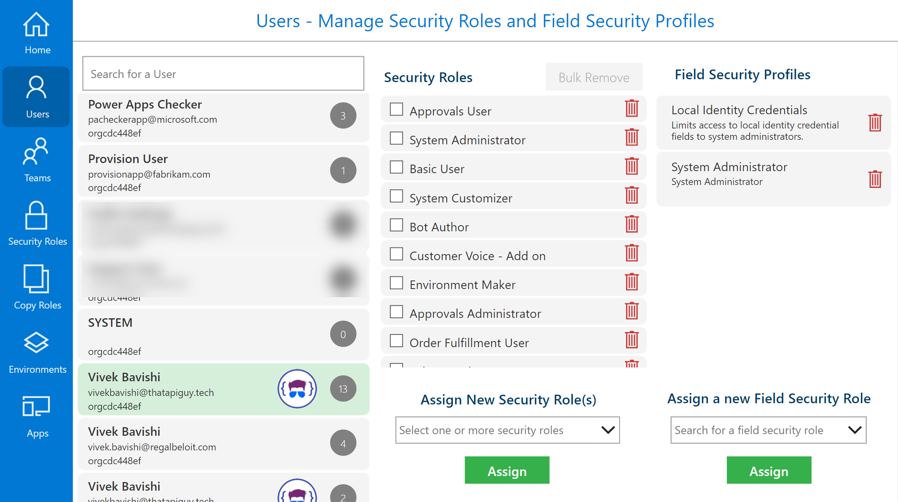
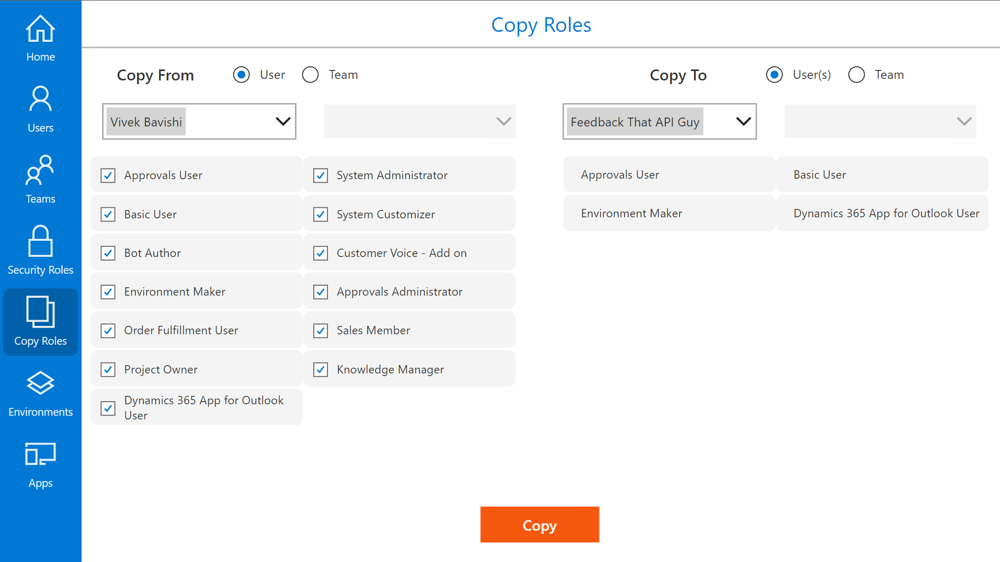

# Dataverse Admin

## Summary

The Dataverse admin app enables admins to easily manage users/teams/security roles/apps and perform some repetitive tasks more efficiently.





## Applies to

* [Microsoft Power Apps](https://docs.microsoft.com/powerapps/)


## Compatibility


## Version history

Version|Date|Comments
-------|----|--------
1.0|Feb 17, 2022|Initial release

## Features

All the following operations can be performed using this app:
* Manage Security roles of Users and Teams.
* Add / remove amultiple users from a Security Role.
* Copy Security roles from one user/team to another.
* Add users to an environment.
* Manage app permissions for all the apps in a tenant.

## Prerequisites

You need to be a system admin in order to perform all the operations listed above. Though the app will work partly for makers, the intended audience for this app is system admins.

## Data Sources

* Dataverse

## Minimal Path to Awesome

* [Download](./solution/DataverseAdmin.msapp) the `.msapp` from the `solution` folder
* Use the `.msapp` file using **File** > **Open** > **Browse** within Power Apps Studio.
* Save and Publish

## Using the Source Code

You can also use the [Power Apps CLI](https://docs.microsoft.com/powerapps/developer/data-platform/powerapps-cli) to pack the source code by following these steps::

* Clone the repository to a local drive
* Pack the source files back into `.msapp` file:
  ```bash
  pac canvas pack --sources pathtosourcefolder --msapp pathtomsapp
  ```
  Making sure to replace `pathtosourcefolder` to point to the path to this sample's `sourcecode` folder, and `pathtomsapp` to point to the path of this solution's `.msapp` file (located under the `solution` folder)
* Within **Power Apps Studio**, use the `.msapp` file using **File** > **Open** > **Browse** and select the `.msapp` file you just packed.

## Disclaimer

**THIS CODE IS PROVIDED *AS IS* WITHOUT WARRANTY OF ANY KIND, EITHER EXPRESS OR IMPLIED, INCLUDING ANY IMPLIED WARRANTIES OF FITNESS FOR A PARTICULAR PURPOSE, MERCHANTABILITY, OR NON-INFRINGEMENT.**

## Help

If you encounter any issues while using this sample, or would like to provide feedback or any ideas, please submit it as an issue on this repository

## For more information

- [Overview of creating apps in Power Apps](https://docs.microsoft.com/powerapps/maker/)
- [Power Apps canvas apps documentation](https://docs.microsoft.com/en-us/powerapps/maker/canvas-apps/)


---
